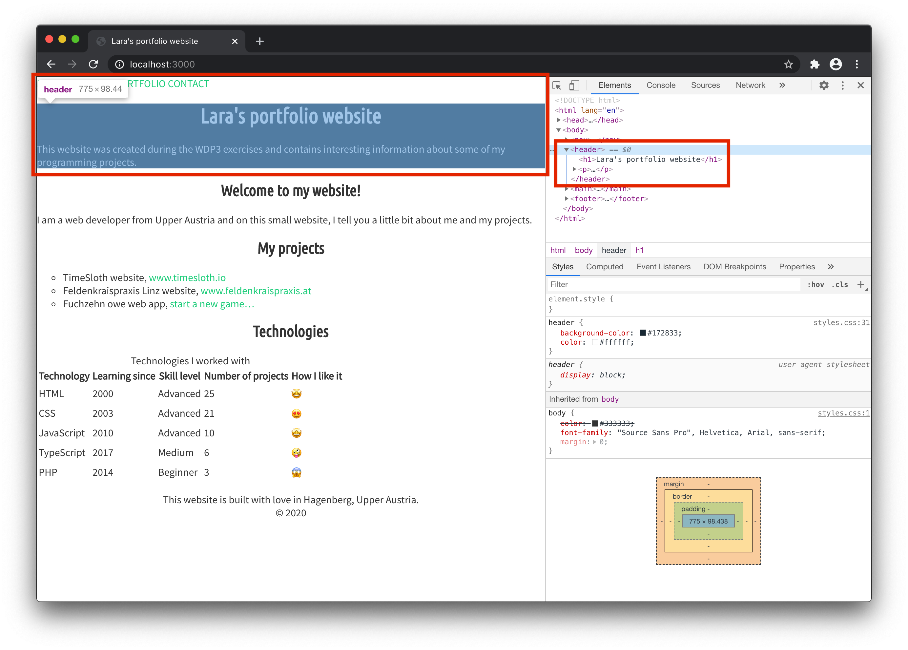
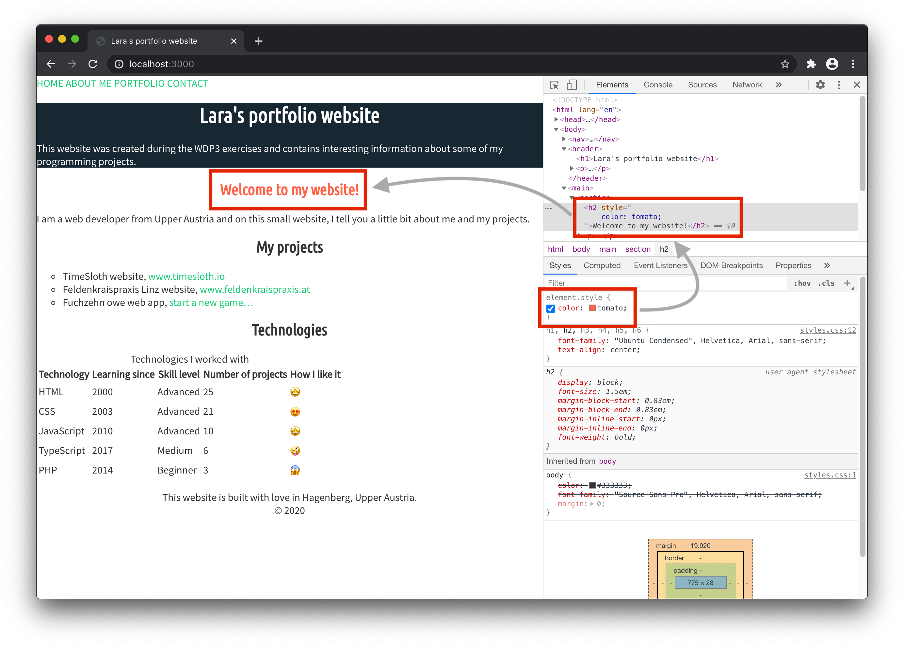
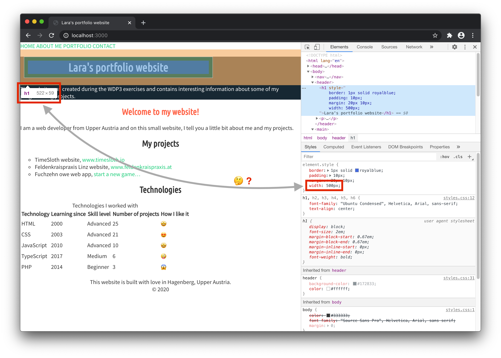
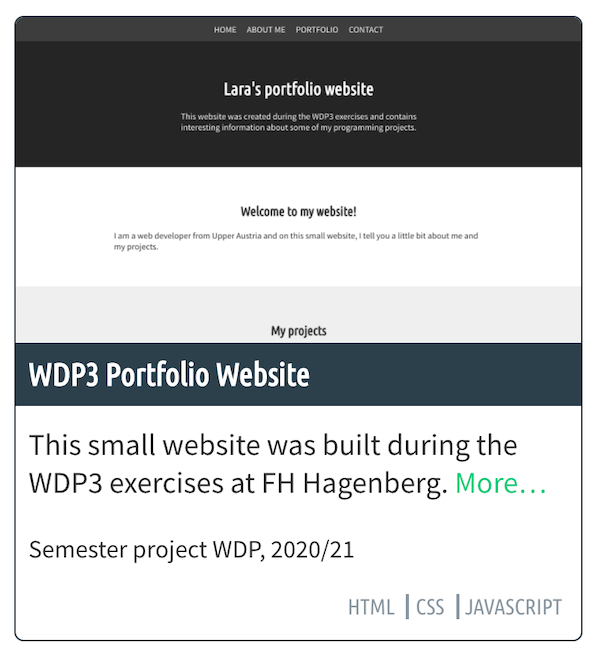
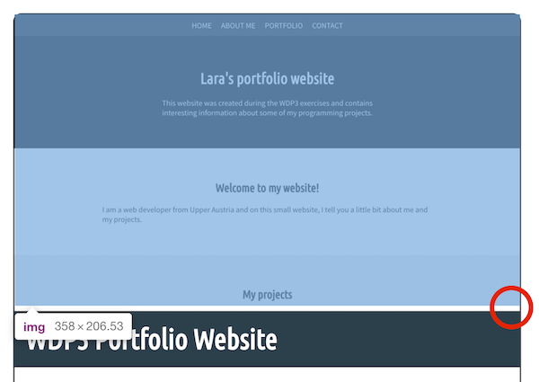

# WDP3 – Exercise 3

CSS Basics: Let's add some styling to our website we started to create in the first exercise. This time, we will add text styles, colors and spacings.

## 1 The styles.css file

For this website we will create one single CSS file that contains all our styles. (You can also split your CSS code up into more than one file, but don't forget to link all of them in the HTML files where you need them.)

Create a file called `styles.css` next to your `index.html` file and add a link to it in the head of your HTML file.

```html
<link rel="stylesheet" href="styles.css" />
```

For a quick check if everything works, set the background-color of your whole page to red and have a look at your `index.html` page in the browser. You'll have to reload the page everytime you make changes to actually see them in the browser!

```css
body {
  background-color: red;
}
```

> Note: Don't forget the semicolon after each CSS rule!

When you've successfully linked the index page and the CSS file, reference the stylesheet in all other HTML files (about, portfolio, contact) as well (and change the background color back to something less red…).

### 1.1 Text

Choose two fonts for your website from [Google Fonts](https://fonts.google.com). Use one for headlines and the other one for body text. You can also use one font and select, for example, the regular style for the body text and the bold style for headlines.

> If you found a font you like, check out the font pairings suggested by Google Fonts, maybe there's another one you can use as second font. Don't spend too much time on Google Fonts now, you can always change the font later if you found another one you like better!

Copy and paste the `link` you can find in the embed-tab on Google Fonts into the head of your HTML files.

Define the `font-family` for your website body text in the CSS file. Don't forget to add a fallback font (separated by a comma) in case the font from Google can't be loaded.

```css
body {
  font-family: "Source Sans Pro", Helvetica, Arial, sans-serif;
}

h1,
h2,
h3,
h4,
h5,
h6 {
  font-family: "Second Font", Georgia, "Times New Roman", serif;
}
```

Play around with the `text-alignment` property – maybe center your headlines?

You could also set the `text-transform` property to `uppercase` for headlines or the links in your navigation.

### 1.2 Colors

Change the text color for your website. Use a different color for headlines and body text.

In the readme section of this repository you can find a list of [design resources](https://github.com/lara-amalia/se-wdp-ue#design-resources) that may be useful when looking for a color theme for your website.

Change the background color of some special sections, for example the header or the footer. Here's a trick how you can set the color for every second section to a light gray (instead of the default white background) if your HTML code is structured like this (sections have to be siblings):

```html
<main>
  <section>
    <!-- section content -->
  </section>
  <section>
    <!-- section content -->
  </section>
  <section>
    <!-- section content -->
  </section>
  <!-- and so on -->
</main>
```

```css
section:nth-child(even) {
  background-color: #efefef;
}

/* or */

section:nth-child(2n) {
  background-color: #efefef;
}
```

### 1.3 Links

Define styles for your links. Choose a color, define whether they should be underlined or not, and add a hover style (change color, change the background-color, change the text-decoration)…

Here is an example:

```css
a {
  color: #1acc78;
  text-decoration: none;
}

a:hover {
  background-color: #efefef;
}
```

## 2 Designing in the browser

Now we've added some basic styles, go back to the website in your browser – this time I'd suggest to use Chrome or Firefox – and open the developer tools. Select the elements tab and click through the HTML elements you already styled.



Note that in the developer tools' styles pane you can find all the CSS rules from your stylesheet. It's very useful for debugging (to find answers to questions like ”Why is the headline purple and not red?”) and also for designing directly in the browser.

Take some minutes to explore what you can do there. Try to:

- Change the color of headlines
- Change the text-alignment
- Change the (font) size of elements
- Disable styles coming from your stylesheet file
- …



> Note that changes you made using developer tools are not automatically saved to your CSS file. If you made changes you want to keep, go back to your stylesheet file and add them there as well!

> Note that once you reload the page in your browser, all changes you made in the developer tools are lost.

The developer tools give you information about the source of CSS rules (`user agent stylesheet` vs. your own `styles.css` vs. inline styles), inheritance and more.

## 3 The CSS box model

Remember the CSS box model? When you select a block element (a headline or a paragraph for example) in the elements pane of the browser's developer tools and have a look again at the styles pane, you can find all properties of the element's box there:

- the content
- the padding
- the border
- the margin

Note that headlines and paragraphs already have a margin-top and a margin-bottom. This is part of the brower's default styles (`user agent stylesheet`).

Try to add a border and some padding and margin to a block element. For example:

```css
h1 {
  border: 1px solid royalblue;
  padding: 10px; /* Shorthand for padding-top, -right, -bottom, -left */
  margin: 20px 10px; /* Shorthand for margin-top, -bottom and margin-left, -right */
}
```

Now find out the current width of the element. In my case it's `755px`.


Change the width to something else, for example:

```css
h1 {
  width: 500px;
}
```

Think about what's the width of the `h1` element now. Remember what we've learned about box-sizing…

Correct, if you didn't change the `box-sizing` property for elements on your website until now, the width of the headline is not 500px but 500 + 2x10 + 2x1 = 522px. Why? The default value for `box-sizing` is `content-box`. That means if you change the width of your element via CSS, you change the width of the content only, but the width you probably want to control is everything including the border, which is now 522px (the content + the padding on each side + the border on each side).



It's more intuitive to set the value for `box-sizing` to `border-box`, so we'll do that now (to make our lives easier next time when we are going to build our website's layout) by adding the following rule on top of our CSS file:

```css
* {
  box-sizing: border-box;
}
```

> Note: The asterisk `*` is the universal selector. It selects every element and doesn't change the specificity of a selector. Find more information [in the official documentation](https://drafts.csswg.org/selectors-3/#universal-selector).

### 3.1 Add spacing

Add more space between elements by adding padding and/or margin to sections like the header, content sections or the footer.

### 3.2 Navigation

Change the styling of your navigation links so that they stand out and are clearly recognizeable as navigation. Some ideas:

- give the `nav` element a background color other than white (if that's your body background color)
- change the font color of the navigation links
- change the alignment of the nav items (right or center)

## 4 Portfolio page

Last time we didn't add any content to our portolio page. Let's do that now! Open `portfolio.html` in your text editor and add a navigation, a header, a main section, and a footer to the page body. (You can reuse the navigation, header and footer from the other pages.)

```html
<body>
  <nav>
    <a href="./index.html">Home</a>
    <a href="./about.html">About me</a>
    <a href="./portfolio.html">Portfolio</a>
    <a href="./contact.html">Contact</a>
  </nav>
  <header>
    <h1>Portfolio</h1>
  </header>
  <main>
    <!-- TODO: Portfolio items -->
  </main>
  <footer>
    <p>
      This website is built with love in Hagenberg, Upper Austria.<br />
      © 2020
    </p>
  </footer>
</body>
```

In the main section we want to show an overview of (software) projects we did in the past and projects we are currently working on. It should look similar to a news overview page or a blog overview page in the end.

We need to add some HTML content we can style later. On the overview page we will display the following data for each project:

- name
- short description
- technologies
- metadata (e.g. year)
- image (screenshot)
- a link to a details page (optional)

In code one project entry could look as follows:

```html
<div class="project">
  
  <h2 class="project-title">WDP3 Portfolio Website</h2>
  <div class="project-content">
    <p class="project-description">
      This small website was built during the WDP3 exercises at FH Hagenberg.
      <a href="./portfolio/wdp3-project.html">More…</a>
    </p>
    <p class="project-metadata">Semester project WDP, 2020/21</p>
    <ul class="project-technologies">
      <li>HTML</li>
      <li>CSS</li>
      <li>JavaScript</li>
    </ul>
  </div>
</div>
```

And now the fun part 🎉 – let's play around with CSS and style the project entry. We'll need the following CSS properties:

- font-size
- color
- background-color
- width, max-width
- padding
- margin
- border (shorthand for border-width, border-style, border-color)
- border-radius
- display

Try to make your design look similar to the following screenshot. Feel free to style the entry completely different if you have your own design ideas!



### 4.1. Problems with the image?

If you follow my design suggestion you may run into problems with the image above the project title. A few things about that…

Images usually take the space they need. If you include an image that's 1000px wide it will be 1000px wide on your website no matter where you place it. Therefore one CSS rule I almost always add to my base styles is the following:

```css
img {
  max-width: 100%;
}
```

This way it's guaranteed that the image will never be wider than its parent element. If the project entry `div` has a width of, let's say, 400px, the image will be 400px wide on screen (while the actual size of the image file is still 1000px).

Images are inline elements, not block elements! A side effect of this fact is that if the image is followed by a colored area below there will be a small gap between the image and the next block element.



This is no margin or padding… this is the space reserved for descenders of letters. The bottom edge of the image is always in line with a text's baseline which results in a gap below the image. How to fix this? Let's extend our CSS rule for images:

```css
img {
  max-width: 100%;
  display: block;
}
```

> Note that now all images are treated like block-elements and have all properties a block-element has!

If you add a border radius to the project entry `div` and you take a closer look at the top corners you can see that the image is not affected by this border radius and overflows.


So we have to hide the overflow in order to fix this as follows:

```css
.project {
  border-radius: 8px;
  overflow: hidden;
}
```

### 4.2. Display inline vs. block

We already heard about inline and block elements. Both have different interesting properties. Block elements are full-width boxes that generate line breaks before and after the element. ”We can give them width, height, margin as well as padding, and these properties will push other elements on the page away from them.” <sup>[1](https://www.smashingmagazine.com/2019/04/display-two-value/)</sup> Inline elements are on the same line when there is enough space available. ”If you add margins and padding, this will display but it won’t push other elements away.” <sup>[1](https://www.smashingmagazine.com/2019/04/display-two-value/)</sup>

Every inline-element can be made a block-element and vice versa by setting the `display` property accordingly. For example:

```css
img {
  /* inline element by default */
  display: block;
}

h3 {
  /* block element by default */
  display: inline;
}
```

By making inline-elements out of the list items of the technologies-list, I made them sit on one line and not below each other. Here's the CSS code:

```css
.project-technologies {
  list-style: none;
  padding: 0;
  text-align: right;
}

.project-technologies li {
  display: inline; /* Now the items sit on one line next to each other. */
  padding-left: 4px;
  padding-right: 4px;
}

.project-technologies li + li {
  border-left: 2px solid #8a97a1;
}
```

By using the adjacent sibling combinator (+) for my last selector I only have a line between the items but not before the first one or after the last one.

---

## Further reading

[1] [Digging into the display property](https://www.smashingmagazine.com/2019/04/display-two-value/) by Rachel Andrew

[2] [Introduction to the CSS box model (MDN)](https://developer.mozilla.org/en-US/docs/Web/CSS/CSS_Box_Model/Introduction_to_the_CSS_box_model)
